# Nginx简介

## Nginx概述

Nginx ("engine x") 是一个高性能的 HTTP 和反向代理服务器,特点是占有内存少，并发能 力强，事实上 nginx 的并发能力确实在同类型的网页服务器中表现较好，中国大陆使用 nginx 网站用户有：百度、京东、新浪、网易、腾讯、淘宝等

## Nginx作为web服务器

Nginx可以作为静态页面的web服务器，同时还支持CGI协议的动态语言，比如perl、php等。但是不支持java。Java程序只能通过与tomcat配合完成。Nginx专为性能优化而开发， 性能是其最重要的考量，实现上非常注重效率 ，能经受高负载的考验，有报告表明能支持高 达 50000 个并发连接数。

## 正向代理

Nginx 不仅可以做反向代理，实现负载均衡。还能用作正向代理来进行上网等功能。 正向代理：如果把局域网外的Internet想象成一个巨大的资源库，则局域网中的客户端要访问Internet，则需要通过代理服务器来访问，这种代理服务就称为正向代理


## 反向代理

反向代理，其实客户端对代理是无感知的，因为客户端不需要任何配置就可以访问，我们只需要将请求发送到反向代理服务器，由反向代理服务器去选择目标服务器获取数据后，在返回给客户端，此时反向代理服务器和目标服务器对外就是一个服务器，暴露的是代理服务器地址，隐藏了真实服务器IP地址。


**自己认为**：反向代理和正向代理的区别是是否知道我们要访问的服务器的地址，如果不知道，则是反向代理。如果知道，但不能直接访问就是正向代理

## 负载均衡

客户端发送多个请求到服务器，服务器处理请求，有一些可能要与数据库进行交互，服务器处理完毕后，再将结果返回给客户端。 

这种架构模式对于早期的系统相对单一，并发请求相对较少的情况下是比较适合的，成本也低。但是随着信息数量的不断增长，访问量和数据量的飞速增长，以及系统业务的复杂度增加，这种架构会造成服务器相应客户端的请求日益缓慢，并发量特别大的时候，还容易造成服务器直接崩溃。很明显这是由于服务器性能的瓶颈造成的问题，那么如何解决这种情况呢？

我们首先想到的可能是升级服务器的配置，比如提高CPU 执行频率，加大内存等提高机器的物理性能来解决此问题，但是我们知道摩尔定律的日益失效，硬件的性能提升已经不能 满足日益提升的需求了。最明显的一个例子，天猫双十一当天，某个热销商品的瞬时访问量 是极其庞大的，那么类似上面的系统架构，将机器都增加到现有的顶级物理配置，都是不能够满足需求的。

那么怎么办呢？ 上面的分析我们去掉了增加服务器物理配置来解决问题的办法，也就是说纵向解决问题的办法行不通了，那么横向增加服务器的数量呢？这时候集群的概念产生了，单个服务器解决不了，我们增加服务器的数量，然后将请求分发到各个服务器上，将原先请求集中到单个服务器上的情况改为将请求分发到多个服务器上，将负载分发到不同的服务器，也就是我们所说的负载均衡。


## 动静分离

为了加快网站的解析速度，可以把动态页面和静态页面由不同的服务器来解析，加快解析速度。降低原来单个服务器的压力。


#  Nginx 安装

## 下载

进入[Nginx官网](http://nginx.org )选择对应的版本进行下载

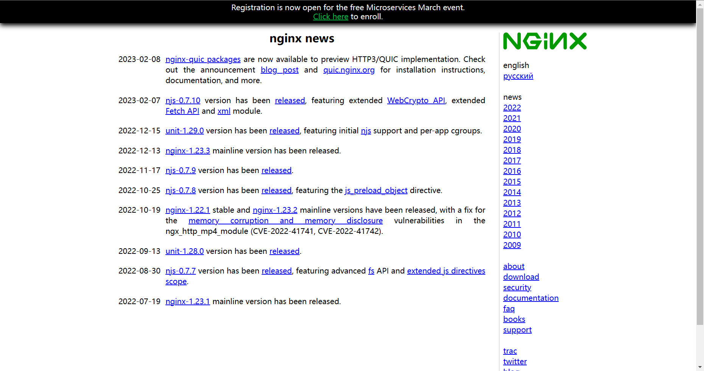

## Linux安装Nginx及其依赖

### 安装pcre依赖

PCRE库支持正则表达式。如果我们在配置文件nginx.conf中使用了正则表达式，那么在编译Nginx时就必须把PCRE库编译进Nginx，因为Nginx的HTTP模块需要靠它来解析正则表达式。另外，pcre-devel是使用PCRE做二次开发时所需要的开发库，包括头文件等，这也是编译Nginx所必须使用的。

#### 方式一：网络下载安装

```bash
wget http://downloads.sourceforge.net/project/pcre/pcre/8.37/pcre-8.37.tar.gz
```

#### 方式二：解压文件

1. 将文件上传到Linux系统中，并解压

   ```bash
   #解压命令
   tar -xvf pcre-8.37
   ```

2. 进入解压后的目录，然后执行`./configure`。其目的是用于安装包的检查

   ```bash
   #进入解压后的文件
   cd pcre-8.37
   #检查安装包是否正确
   ./configure
   ```

3. 执行`make install`。把软件进行编译并进行安装

4. 查看我们安装pcre的版本

   ```bash
   pcre-config --version
   ```

### 安装openssl

下面安装

### 安装zlib

zlib是提供数据压缩用的函式库

#### 方式一：网络下载安装

```bash
yum -y install make zlib zlib-devel gcc-c++ libtool openssl openssl-devel
```

#### 方式二：解压文件

略：pcre已经演示

### 安装nginx

上文安装pcre依赖已经详细解释，此处略写

- 解压缩`nginx-xx.tar.gz`包。
- 进入解压缩目录，执行`./configure`
- `make`&&`make install`

安装成功会在`/usr/local`下生成`nginx`目录

### 补充

#### 查看开放的端口号

```bash
firewall-cmd --list-all
```

#### 设置开放的端口号

```bash
firewall-cmd --add-service=http –permanent
sudo firewall-cmd --add-port=80/tcp --permanent
```

#### 重启防火墙

```bash
firewall-cmd –reload
```

#### 切换yum源

如果出现镜像问题可以按照如下进行设置

1. 需要提前安装wget命令

   ```bash
   yum install wget -y
   ```

2. 切换到yum的安装目录

   ```bash
   /etc/yum.repos.d/
   ```

3. 将所有的已经存在的文件添加备份，以下两种方式任选其一：

   1. 给文件该名称添加.bak
   2. 创建backup目录，将所有的文件移动进去

4. 打开阿里云镜像网站

   - 方式一：打开镜像网站 [https://mirrors.aliyun.com ](https://mirrors.aliyun.com/)下载阿里云镜像repo文件

   - 方式二：也可以用wget下载下来

     ```bash
     wget -O /etc/yum.repos.d/CentOS-Base.repo http://mirrors.aliyun.com/repo/Centos-6.repo
     ```

5. 清除yum的已有缓存

   ```bash
   yum clean all
   ```

6. 生成yum的缓存

   ```bash
   yum makecache
   ```

# Nginx常用的命令和配置文件

## Nginx常用的命令

以下目录都为Nginx的的安装目录的bin目录。

### 启动命令

```bash
./nginx
```

在/usr/local/nginx/sbin 目录下执行`./nginx`。

### 关闭命令

```bash
./nginx -s stop
```

在/usr/local/nginx/sbin 目录下执行`./nginx -s stop`。

### 重新加载命令

```bash
./nginx -s reload
```

在/usr/local/nginx/sbin 目录下执行`./nginx -s reload`。

### 补充

查看nginx是否启动

```bash
ps -ef | grep nginx
```

其中nginx可以换成其他程序进行查询是否在运行

## nginx.conf 配置文件

### 第一部分：全局块

Nginx安装目录下，其默认的配置文件都放在这个目录的conf目录下，而主配置文件`nginx.conf`也在其中，后续对nginx的使用基本上都是对此配置文件进行相应的修改。

### 第二部分：events块

events块涉及的指令主要影响Nginx服务器与用户的网络连接

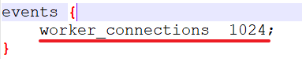

常用的设置包括是否开启对多work process下的网络连接进行序列化，是否允许同时接收多网络连接，选取哪种事件驱动模型来处理连接请求，每个word  process可以同时支持的最大连接数等。上述例子就表示每个work process 支持的最大连接数为 1024。这部分的配置对Nginx的性能影响较大，在实际中应该灵活配置。

### 第三部分：http块

这算是Nginx服务器配置中最频繁的部分，代理、缓存和日志定义等绝大多数功能和第三方模块的配置都在这里。

 需要注意的是：**http块也可以包括http全局块、server 块。**

#### http 全局块

http 全局块配置的指令包括文件引入、MIME-TYPE定义、日志自定义、连接超时时间、单链接请求数上限等。

#### server 块

这块和虚拟主机有密切关系，虚拟主机从用户角度看，和一台独立的硬件主机是完全一样的，该技术的产生是为了节省互联网服务器硬件成本。

每个http块可以包括多个server 块，而每个server块就相当于一个虚拟主机。

而每个server块也分为全局server块，以及可以同时包含多个locaton块。

- 全局server块

  最常见的配置是本虚拟机主机的监听配置和本虚拟主机的名称或IP配置。

- location 块

  一个server块可以配置多个location块。 这块的主要作用是基于Nginx服务器接收到的请求字符串（例如 server_name/uri-string），对虚拟主机名称（也可以是 IP 别名）之外的字符串（例如 前面的 /uri-string）进行匹配，对特定的请求进行处理。地址定向、数据缓 存和应答控制等功能，还有许多第三方模块的配置也在这里进行

# Nginx配置实例

## 反向代理

### 反向代理实例一

实现效果：使用 nginx反向代理，访问www.123.com直接跳转到127.0.0.1:8080

#### 实验代码

1. 启动一个tomcat

2. 通过修改本地 host 文件，将www.123.com映射到127.0.0.1。意思是让www.123.com等同与127.0.0.1。前为IP后为网址，其格式如下：

   

   配置完成之后，我们便可以通过www.123.com:8080访问到第一步出现的Tomcat初始界面。那么如何只需要输入www.123.com便可以跳转到Tomcat初始界面呢？便用到nginx的反向代理。

3. 在nginx.conf配置文件中增加如下配置

   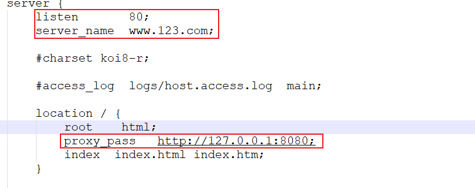

   我们监听80端口，访问域名为 www.123.com，不加端口号时默认为80端口，故访问该域名时会跳转到127.0.0.1:8080路径上。

### 反向代理实例二

实现效果：使用nginx反向代理，根据访问的路径跳转到不同端口的服务中

- nginx监听端口为9001
- 访问http://127.0.0.1:9001/edu/直接跳转到127.0.0.1:8081
- 访问 http://127.0.0.1:9001/vod/ 直接跳转到 127.0.0.1:8082

#### 实验代码

准备两个tomcat，一个8001端口，一个8002端口，并准备好测试的页面

修改nginx的配置文件在http块中添加server{}，修改如下：

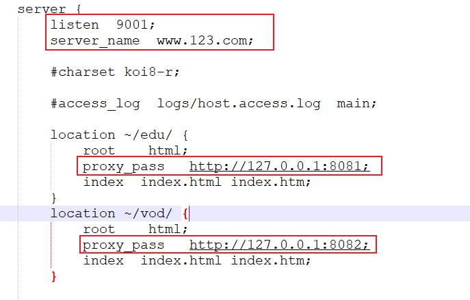

#### 补充

- `=` ：用于不含正则表达式的uri前，要求请求字符串与uri严格匹配，如果匹配成功，就停止继续向下搜索并立即处理该请求。
- `~`：用于表示uri包含正则表达式，并且区分大小写。
- `~*`：用于表示uri包含正则表达式，并且不区分大小写。
- `^~`：用于不含正则表达式的uri前，要求Nginx服务器找到标识uri和请求字符串匹配度最高的location后，立即使用此location处理请求，而不再使用location 块中的正则uri和请求字符串做匹配。

## 负载均衡

### 实现效果

配置负载均衡

### 实验代码

1. 首先准备两个同时启动的Tomcat
2. 在nginx.conf中进行配置

### 配置说明

#### 轮询（默认）

每个请求按时间顺序逐一分配到不同的后端服务器，如果后端服务器down掉，能**自动剔除**。

#### weight

weight代表权，重默认为1，权重越高被分配的客户端越多。指定轮询几率，weight和访问比率成正比，用于后端服务器性能不均的情况。例如：

```bash
upstream server_pool{ 
	server 192.168.5.21 weight=10; 
	server 192.168.5.22 weight=10; 
}
```

#### ip_hash

每个请求按访问ip的hash结果分配，这**样每个访客固定访问一个后端服务器**，可以解决session的问题。例如：

```bash
upstream server_pool{
	ip_hash; 
	server 192.168.5.21:80; 
	server 192.168.5.22:80; 
}
```

#### fair（第三方）

按后端服务器的响应时间来分配请求，响应时间短的优先分配。

```bash
upstream server_pool{ 
	server 192.168.5.21:80; 
	server 192.168.5.22:80; 
	fair; 
}
```

## 动静分离

Nginx动静分离简单来说就是把动态跟静态请求分开，不能理解成只是单纯的把动态页面和静态页面物理分离。严格意义上说应该是动态请求跟静态请求分开，可以理解成使用Nginx处理静态页面，Tomcat处理动态页面。

动静分离从目前实现角度来讲大致分为两种，一种是纯粹把静态文件独立成单独的域名，放在独立的服务器上，也是目前主流推崇的方案；

另外一种方法就是动态跟静态文件混合在一起发布，通过nginx来分开。通过location指定不同的后缀名实现不同的请求转发。通过expires（过期）参数设置，可以使浏览器缓存过期时间，减少与服务器之前的请求和流量。具体Expires定义：是给一个资源设定一个过期时间，也就是说无需去服务端验证，直接通过浏览器自身确认是否过期即可，所以不会产生额外的流量。此种方法非常适合不经常变动的资源。（如果经常更新的文件， 不建议使用 Expires 来缓存），我这里设置3d，表示在这3天之内访问这个URL，发送一个请求，比对服务器该文件最后更新时间没有变化，则不会从服务器抓取，返回状态码304（缓存的效果），如果有修改，则直接从服务器重新下载，返回状态码200。

### 实验代码

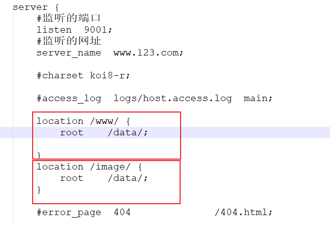

**说明：当访问www\.123.com/www/时会将root加到该值前面如：www\.123.com/data/www/。**

#  nginx 原理与优化参数配置

原理图：


流程图：


## master-workers 的机制的好处

首先，对于每个worker进程来说，独立的进程，不需要加锁，所以省掉了锁带来的开销，同时在编程以及问题查找时，也会方便很多。其次，采用独立的进程，可以让互相之间不会 影响，一个进程退出后，其它进程还在工作，服务不会中断，master进程则很快启动新的worker进程。当然，worker进程的异常退出，肯定是程序有bug了，异常退出，会导致当前worker上的所有请求失败，不过不会影响到所有请求，所以降低了风险。

## 需要设置多少个worker

Nginx同redis类似都采用了io多路复用机制，每个worker都是一个独立的进程，但每个进程里只有一个主线程，通过异步非阻塞的方式来处理请求， 即使是千上万个请求也不在话 下。每个worker的线程可以把一个cpu的性能发挥到极致。所以worker数和服务器的cpu数相等是最为适宜的。设少了会浪费cpu设多了会造成cpu频繁切换上下文带来的损耗。

### 设置worker数量

```
worker_processes 4
#work 绑定 cpu(4 work 绑定 4cpu)。
worker_cpu_affinity 0001 0010 0100 1000
#work 绑定 cpu (4 work 绑定 8cpu 中的 4 个) 。
worker_cpu_affinity 0000001 00000010 00000100 00001000
```

### 连接数worker_connection

这个值是表示每个worker进程所能建立连接的最大值，所以，一个nginx能建立的最大连接数，应该是worker_connections * worker_processes。当然，这里说的是最大连接数，对于HTTP请求本地资源来说 ， 能够支持的最大并发数量是worker_connections *  worker_processes，如果是支持http1.1 的浏览器每次访问要占两个连接，所以普通的静态访问最大并发数是：worker_connections * worker_processes /2，而如果是HTTP作为反向代理来说，最大并发数量应该是worker_connections *  worker_processes/4。因为作为反向代理服务器，每个并发会建立与客户端的连接和与后端服务的连接，会占用两个连接。

worker_connections就是在nginx.conf中设置的连接数

# nginx 搭建高可用集群

## Keepalived+Nginx高可用集群（主从模式）


红色IP为虚拟IP

### 准备

要是用Nginx的集群必须在每台服务器中安装keepalived：

1. 使用域名命令进行安装

   ```bash
   yum install keepalived -y
   ```

2. 安装之后，在etc里面生成目录keepalived，有keepalived.conf，此目录就是我们日后配置Nginx集群的地方（Nginx不需要做修改）

### 配置

在keepalived.conf中配置

```bash
#全局配置
global_defs { 
 notification_email { 
 acassen@firewall.loc 
 failover@firewall.loc 
 sysadmin@firewall.loc 
 } 
 notification_email_from Alexandre.Cassen@firewall.loc 
 smtp_server 192.168.17.129 
 smtp_connect_timeout 30 
 #LVS_DEVEL是唯一的值，不能重复
 router_id LVS_DEVEL #访问到主机，自己主机的名字
}

vrrp_script chk_http_port { 
 #用于检测nginx是否还活着的脚本路径（自己写）
 script "/usr/local/src/nginx_check.sh" 
 
 interval 2 #（检测脚本执行的间隔） 
 #权重
 weight -20
}

#虚拟IP的一些配置
vrrp_instance VI_1 { 
 state BACKUP # 备份服务器上将 MASTER 改为 BACKUP 。此处用于那个是主机那个是从机
 interface ens33 #选择在那个网卡上绑定Nginx的名字 （ifconfig查看）
 virtual_router_id 51 # 主、备机的 virtual_router_id 必须相同 
 priority 100 # 主、备机取不同的优先级，主机值较大，备份机值较小 
 advert_int 1  
 authentication { 
 auth_type PASS 
 auth_pass 1111 
 } 
 virtual_ipaddress { 
 192.168.17.50 # VRRP H 虚拟地址 
 } 
} 
```

脚本文件如下：

```shell
# !/bin/bash 
# 用于检测nginx是否还活着
A=`ps -C nginx –no-header |wc -l` 
if [ $A -eq 0 ];then 
#nginx所在的位置
 /usr/local/nginx/sbin/nginx 
 sleep 2 
 if [ `ps -C nginx --no-header |wc -l` -eq 0 ];then 
 killall keepalived 
 fi 
fi 
```

### 测试

两台主机启动都按如下执行

```bash
#启动nginx
./nginx
#启动keepalived
systemctl start keepalived.service
```

### 参数解释

#### router_id

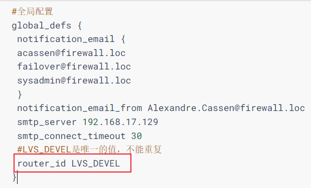

其名字要在host文件中进行修改，输入：`vim /etc/hosts`之后进行修改

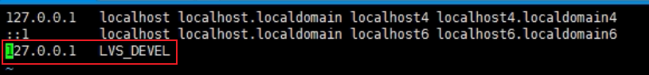

#### interval

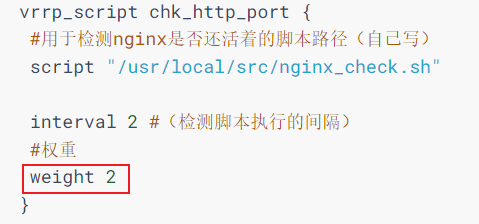

表示每隔两秒检测一次

#### weight

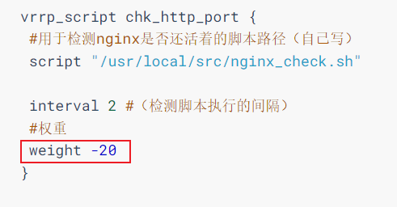

表示当使用检测到本机宕机，就会将自身的优先级降低20（从vrrp_instance的priority的内容进行加减）

#### state

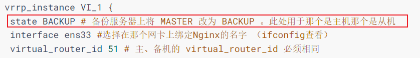

表示本机是主机还是从机

#### interface

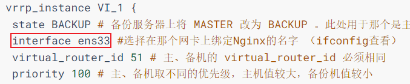

写网卡的名称，通过`ipconfig`命令来查看是那个网卡

#### virtual_router_id

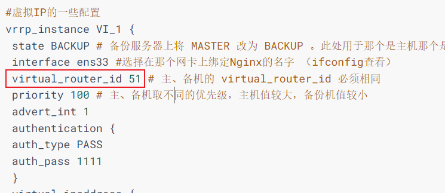

此处主从机的ip必须相同

#### priority

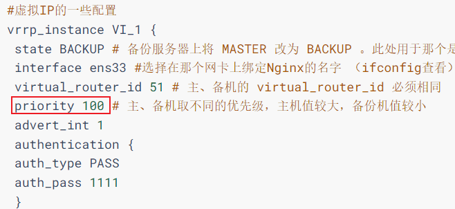

#### advert_int

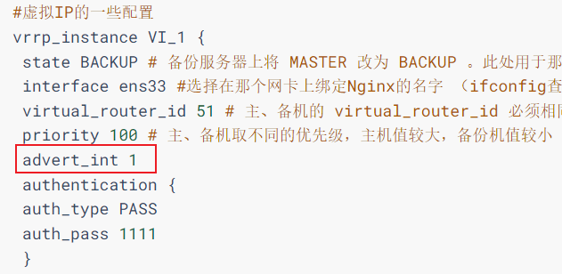

每隔1秒检测一次主机是否活着

#### authentication

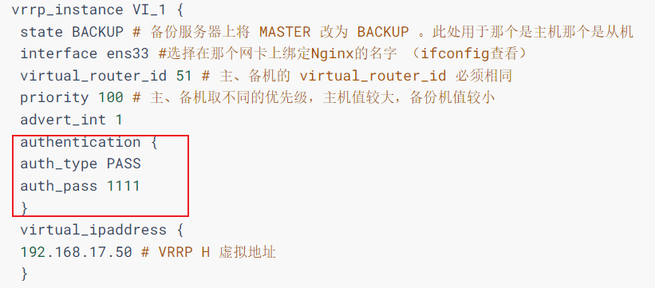

`auth_type`表示权限校验的方式（设置的是密码校验）

`auth_pass`表示验证的密码是多少

#### virtual_ipaddress

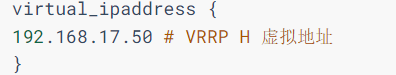

虚拟IP的地址，可以绑定多个

##  Keepalived+Nginx 高可用集群（双主模式）

不想写了，略