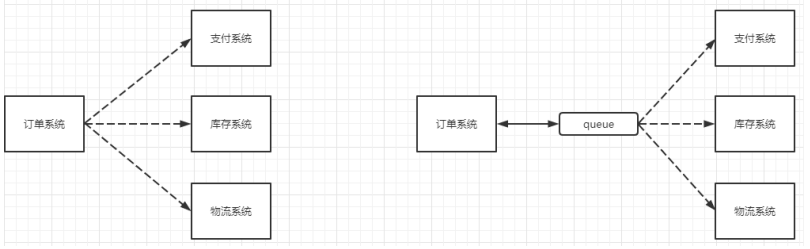
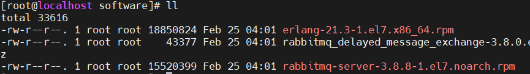

# 消息队列

## MQ的相关概念

### 什么是 MQ

MQ(message queue)，从字面意思上看，本质是个队列，FIFO先入先出，只不过队列中存放的内容是message而已，还是一种跨进程的通信机制，用于上下游传递消息。在互联网架构中，MQ 是一种非常常 见的上下游“逻辑解耦+物理解耦”的消息通信服务。使用了 MQ 之后，消息发送上游只需要依赖 MQ，不 用依赖其他服务。

### 为什么要用MQ

#### 流量消峰

举个例子，如果订单系统最多能处理一万次订单，这个处理能力应付正常时段的下单时绰绰有余，正常时段我们下单一秒后就能返回结果。但是在高峰期，如果有两万次下单操作系统是处理不了的，只能限制订单超过一万后不允许用户下单。使用消息队列做缓冲，我们可以取消这个限制，把一秒内下的订单分散成一段时间来处理，这时有些用户可能在下单十几秒后才能收到下单成功的操作，但是比不能下单的体 验要好。

#### 应用解耦

以电商应用为例，应用中有订单系统、库存系统、物流系统、支付系统。用户创建订单后，如果耦合调用库存系统、物流系统、支付系统，任何一个子系统出了故障，都会造成下单操作异常。当转变成基于消息队列的方式后，系统间调用的问题会减少很多，比如物流系统因为发生故障，需要几分钟来修复。在这几分钟的时间里，物流系统要处理的内存被缓存在消息队列中，用户的下单操作可以正常完成。当物流系统恢复后，继续处理订单信息即可，中单用户感受不到物流系统的故障，提升系统的可用性。



#### 异步处理

有些服务间调用是异步的，例如A调用B，B 需要花费很长时间执行，但是A需要知道B什么时候可以执行完，以前一般有两种方式，A过一段时间去调用B的查询api查询。或者A提供一个callback api， B 执行完之后调用api通知A服务。这两种方式都不是很优雅，使用消息总线，可以很方便解决这个问题，A调用B服务后，只需要监听 B处理完成的消息，当B处理完成后，会发送一条消息给MQ，MQ会将此消息转发给A服务。这样A服务既不用循环调用B的查询api，也不用提供callback api。同样B服务也不用做这些操作。A服务还能及时的得到异步处理成功的消息。


### MQ 的分类

#### ActiveMQ

优点：单机吞吐量万级，时效性ms级，可用性高，基于主从架构实现高可用性，消息可靠性较低的概率丢失数据

缺点：官方社区现在对ActiveMQ 5.x 维护越来越少，高吞吐量场景较少使用。

#### Kafka

大数据的杀手锏，谈到大数据领域内的消息传输，则绕不开 Kafka，这款为大数据而生的消息中间件，以其百万级TPS的吞吐量名声大噪，迅速成为大数据领域的宠儿，在数据采集、传输、存储的过程中发挥着举足轻重的作用。目前已经被LinkedIn，Uber，Twitter，Netflix等大公司所采纳。

优点: 性能卓越，单机写入TPS约在百万条/秒，最大的优点，就是吞吐量高。时效性ms级可用性非常高，kafka是分布式的，一个数据多个副本，少数机器宕机，不会丢失数据，不会导致不可用,消费者采 用Pull方式获取消息， 消息有序，通过控制能够保证所有消息被消费且仅被消费一次；有优秀的第三方Kafka Web管理界面Kafka-Manager；在日志领域比较成熟，被多家公司和多个开源项目使用；功能支持： 功能较为简单，主要支持简单的 MQ 功能，在大数据领域的实时计算以及日志采集被大规模使用

缺点：Kafka单机超过64个队列/分区，Load 会发生明显的飙高现象，队列越多，load 越高，发送消 息响应时间变长，使用短轮询方式，实时性取决于轮询间隔时间，消费失败不支持重试；支持消息顺序， 但是一台代理宕机后，就会产生消息乱序，社区更新较慢；

#### RocketMQ

RocketMQ出自阿里巴巴的开源产品，用Java语言实现，在设计时参考了Kafka，并做出了自己的一些改进。被阿里巴巴广泛应用在订单，交易，充值，流计算，消息推送，日志流式处理，binglog分发等场景。

优点：单机吞吐量十万级,可用性非常高，分布式架构,消息可以做到 0 丢失,MQ 功能较为完善，还是分 布式的，扩展性好，支持 10 亿级别的消息堆积，不会因为堆积导致性能下降,源码是java我们可以自己阅读源码，定制自己公司的 MQ

缺点：支持的客户端语言不多，目前是 java 及 c++，其中 c++不成熟；社区活跃度一般,没有在 MQ 核心中去实现 JMS 等接口,有些系统要迁移需要修改大量代码

#### RabbitMQ

2007 年发布，是一个在 AMQP（高级消息队列协议）基础上完成的，可复用的企业消息系统，是当前最主流的消息中间件之一。

优点：由于 erlang 语言的高并发特性，性能较好；吞吐量到万级，MQ 功能比较完备,健壮、稳定、易 用、跨平台、支持多种语言 如：Python、Ruby、.NET、Java、JMS、C、PHP、ActionScript、XMPP、STOMP 等，支持 AJAX 文档齐全；开源提供的管理界面非常棒，用起来很好用,社区活跃度高；更新频率相当高。

### MQ 的选择

#### Kafka

Kafka 主要特点是基于 Pull 的模式来处理消息消费，追求高吞吐量，一开始的目的就是用于日志收集 和传输，适合产生大量数据的互联网服务的数据收集业务。大型公司建议可以选用，如果有日志采集功能， 肯定是首选 kafka 了。

#### RocketMQ

天生为金融互联网领域而生，对于可靠性要求很高的场景，尤其是电商里面的订单扣款，以及业务削峰，在大量交易涌入时，后端可能无法及时处理的情况。

#### RoketMQ

在稳定性上可能更值得信赖，这些业务 场景在阿里双 11 已经经历了多次考验，如果你的业务有上述并发场景，建议可以选择 RocketMQ。 

#### RabbitMQ

结合 erlang 语言本身的并发优势，性能好时效性微秒级，社区活跃度也比较高，管理界面用起来十分 方便，如果你的数据量没有那么大，中小型公司优先选择功能比较完备的 RabbitMQ。

## RabbitMQ

### RabbitMQ 的概念

RabbitMQ 的概念  RabbitMQ 是一个消息中间件：它接受并转发消息。你可以把它当做一个快递站点，当你要发送一个包 裹时，你把你的包裹放到快递站，快递员最终会把你的快递送到收件人那里，按照这种逻辑 RabbitMQ 是 一个快递站，一个快递员帮你传递快件。RabbitMQ 与快递站的主要区别在于，它不处理快件而是接收， 存储和转发消息数据。

### 四大核心概念

#### 生产者

产生数据发送消息的程序是生产者

#### 交换机

交换机是 RabbitMQ 非常重要的一个部件，一方面它接收来自生产者的消息，另一方面它将消息 推送到队列中。交换机必须确切知道如何处理它接收到的消息，是将这些消息推送到特定队列还是推 送到多个队列，亦或者是把消息丢弃，这个得有交换机类型决定。

#### 队列

队列是 RabbitMQ 内部使用的一种数据结构，尽管消息流经RabbitMQ 和应用程序，但它们只能存储在队列中。队列仅受主机的内存和磁盘限制的约束，本质上是一个大的消息缓冲区。许多生产者可以将消息发送到一个队列，许多消费者可以尝试从一个队列接收数据。这就是我们使用队列的方式。

#### 消费者

消费与接收具有相似的含义。消费者大多时候是一个等待接收消息的程序。请注意生产者，消费者和消息中间件很多时候并不在同一机器上。同一个应用程序既可以是生产者又是可以是消费者。

### RabbitMQ 核心部分（6大模式）


### 各个名词介绍


- Broker：接收和分发消息的应用，RabbitMQ Server 就是 Message Broker
- Virtual host：出于多租户和安全因素设计的，把 AMQP 的基本组件划分到一个虚拟的分组中，类似于网络中的 namespace 概念。当多个不同的用户使用同一个 RabbitMQ server 提供的服务时，可以划分出多个 vhost，每个用户在自己的 vhost 创建 exchange／queue 等
- Connection：publisher／consumer 和 broker 之间的 TCP 连接
- Channel：如果每一次访问 RabbitMQ 都建立一个 Connection，在消息量大的时候建立 TCP  Connection 的开销将是巨大的，效率也较低。Channel 是在 connection 内部建立的逻辑连接，如果应用程序支持多线程，通常每个 thread 创建单独的 channel 进行通讯，AMQP method 包含了 channel id 帮助客 户端和 message broker 识别 channel，所以 channel 之间是完全隔离的。Channel 作为轻量级的 Connection 极大减少了操作系统建立 TCP connection 的开销
- Exchange：message 到达 broker 的第一站，根据分发规则，匹配查询表中的 routing key，分发消息到 queue 中去。常用的类型有：direct (point-to-point)，topic (publish-subscribe) and fanout  (multicast)
- Queue：消息最终被送到这里等待 consumer 取走
- Binding：exchange 和 queue 之间的虚拟连接，binding 中可以包含 routing key，Binding 信息被保存到 exchange 中的查询表中，用于 message 的分发依据。

### 安装

#### 官网地址

https://www.rabbitmq.com/download.html

#### 文件上传

上传到/usr/local/software 目录下(如果没有 software 需要自己创建)



#### 安装文件(分别按照以下顺序安装)

```bash
#i:表示安装 vh：表示显示进度
rpm -ivh erlang-21.3-1.el7.x86_64.rpm
#是rabbitMQ的依赖包
yum install socat -y
#安装rabbitMQ
rpm -ivh rabbitmq-server-3.8.8-1.el7.noarch.rpm
```

#### 常用命令(按照以下顺序执行)

1. 添加开机启动 RabbitMQ 服务

   ```
   chkconfig rabbitmq-server on
   ```

   

   表示已经开机自启

2. 启动服务

   ```
   /sbin/service rabbitmq-server start 
   ```

3. 查看服务状态

   ```
   /sbin/service rabbitmq-server status
   ```

4. 停止服务(选择执行)

   ```
   /sbin/service rabbitmq-server stop
   ```

5. 开启 web 管理插件

   ```
   rabbitmq-plugins enable rabbitmq_management
   ```

   **注**：安装插件必须要停止服务不然不能安装

   

6. 用默认账号密码(guest)访问地址 http://你的虚拟IP:15672/出现**权限**问题

   

#### 添加一个新的用户

1. 创建账号

   ```
   rabbitmqctl add_user root root
   ```

2. 设置用户角色

   ```
   rabbitmqctl set_user_tags admin administrator
   ```

3. 设置用户权限

   ```bash
   #set_permissions [-p <vhostpath>] <user> <conf> <write> <read>
   rabbitmqctl set_permissions -p "/" admin ".*" ".*" ".*"
   #用户 user_admin 具有/vhost1 这个 virtual host 中所有资源的配置、写、读权限
   ```

   

4. 当前用户和角色

   ```
   rabbitmqctl list_users
   ```

#### 再次利用 admin 用户登录

#### 重置命令

1. 关闭应用的命令为

   ```
   rabbitmqctl stop_app
   ```

2. 清除的命令为

   ```
   rabbitmqctl reset
   ```

3. 重新启动命令为

   ```
   rabbitmqctl start_app
   ```

# Hello World

在下图中，“P”是我们的生产者，“C”是我们的消费者。中间的框是一个队列-RabbitMQ 代表使用者保留的消息缓冲区


## 依赖

```xml
<!--指定 jdk 编译版本-->
<build>
    <plugins>
        <plugin>
            <groupId>org.apache.maven.plugins</gr
            <artifactId>maven-compiler-plugin</ar
            <configuration>
                <source>8</source>
                <target>8</target>
            </configuration>
        </plugin>
    </plugins>
</build>
<dependencies>
    <!--rabbitmq 依赖客户端-->
    <dependency>
        <groupId>com.rabbitmq</groupId>
        <artifactId>amqp-client</artifactId>
        <version>5.8.0</version>
    </dependency>
    <!--操作文件流的一个依赖-->
    <dependency>
        <groupId>commons-io</groupId>
        <artifactId>commons-io</artifactId>
        <version>2.6</version>
    </dependency>
</dependencies>
```

## 消息生产者

```java
public class Producer {
    private final static String QUEUE_NAME = "hello";
    public static void main(String[] args) throws Exception {
        //创建一个连接工厂
        ConnectionFactory factory = new ConnectionFactory();
        factory.setHost("192.168.56.10");//虚拟机的IP
        //rabbitmq的用户名和密码
        factory.setUsername("root");
        factory.setPassword("root");
        //channel 实现了自动 close 接口 自动关闭 不需要显示关闭
        try(Connection connection = factory.newConnection();
            Channel channel = connection.createChannel()) {
            /**
             * 生成一个队列
             * 1.队列名称
             * 2.队列里面的消息是否持久化 默认消息存储在内存中
             * 3.该队列是否只供一个消费者进行消费 是否进行共享，true 可以多个消费者消费
             * 4.是否自动删除 最后一个消费者端开连接以后 该队列是否自动删除 true 自动删除
             * 5.其他参数
             */
            channel.queueDeclare(QUEUE_NAME,false,false,false,null);
            String message="hello world";
            /**
             * 发送一个消息
             * 1.发送到那个交换机，空串表示不指定交换机
             * 2.路由的 key 是哪个
             * 3.其他的参数信息
             * 4.发送消息的消息体，不能直接发送，必须使用二进制发送
             */
            channel.basicPublish("",QUEUE_NAME,null,message.getBytes());
            System.out.println("消息发送完毕");
        }
    }
}
```

## 消息消费者

```java
public class Consumer {
    private final static String QUEUE_NAME = "hello";
    public static void main(String[] args) throws Exception {
        ConnectionFactory factory = new ConnectionFactory();
        factory.setHost("192.168.56.10");
        factory.setUsername("root");
        factory.setPassword("root");
        Connection connection = factory.newConnection();
        Channel channel = connection.createChannel();
        System.out.println("等待接收消息....");
        //推送的消息如何进行消费的接口回调(接受消息成功之后的回调)
        DeliverCallback deliverCallback=(consumerTag, delivery)->{
            //delivery是消息对象，不是一个字符串，需要去除消息体进行打印
            String message= new String(delivery.getBody());
            System.out.println(message);
        };
        //取消消费的一个回调接口 如在消费的时候队列被删除掉了（接受消息失败之后的回调）
        CancelCallback cancelCallback=(consumerTag)->{
            System.out.println("消息消费被中断");
        };
        /**
         * 消费者消费消息
         * 1.消费哪个队列
         * 2.消费成功之后是否要自动应答 true 代表自动应答 false 手动应答（）
         * 3.消息者成功之后的回调
         * 4.消费者未成功消费的回调
         */
        channel.basicConsume(QUEUE_NAME,true,deliverCallback,cancelCallback);
    }
}
```

# Work Queues

工作队列(又称任务队列)的主要思想是避免立即执行资源密集型任务，而不得不等待它完成。 相反我们安排任务在之后执行。我们把任务封装为消息并将其发送到队列。在后台运行的工作进 程将弹出任务并最终执行作业。当有多个工作线程时，这些工作线程将一起处理这些任务。


## 轮训分发消息

在这个案例中我们会启动两个工作线程，一个消息发送线程，我们来看看他们两个工作线程 是如何工作的。

### 抽取工具类

```java
/**
 * 此类为连接工厂创建的工具类
 */
public class RabbitMqUtils {
    //得到一个连接的 channel
    public static Channel getChannel() throws Exception {
        //创建一个连接工厂
        ConnectionFactory factory = new ConnectionFactory();
        factory.setHost("192.168.56.10");//虚拟机的IP
        //rabbitmq的用户名和密码
        factory.setUsername("root");
        factory.setPassword("root");
        Connection connection = factory.newConnection();
        Channel channel = connection.createChannel();
        return channel;
    }
}
```

### 编写消费者线程

#### 消费者代码

```java
/**
 * 这是一个工作线程（一个消费者）
 */
public class Worker01 {
    //队列的名称
    private final static String QUEUE_NAME = "hello";

    public static void main(String[] args) throws Exception {
        //接收消息
        Channel channel = RabbitMqUtils.getChannel();

        //推送的消息如何进行消费的接口回调(接受消息成功之后的回调)
        DeliverCallback deliverCallback = (consumerTag, delivery) -> {
            //delivery是消息对象，不是一个字符串，需要去除消息体进行打印
            String message = new String(delivery.getBody());
            System.out.println("接收到的消息：" + message);
        };
        //取消消费的一个回调接口 如在消费的时候队列被删除掉了（接受消息失败之后的回调）
        CancelCallback cancelCallback = (consumerTag) -> {
            System.out.println(consumerTag + "消息者取消消费接口逻辑");
        };
        System.out.println("c3……");
        channel.basicConsume(QUEUE_NAME, true, deliverCallback, cancelCallback);
    }
}
```

#### 设置多线程启动


### 编写生产者

```java
public class Task01 {
    private final static String QUEUE_NAME = "hello";

    public static void main(String[] args) throws Exception {

        //channel 实现了自动 close 接口 自动关闭 不需要显示关闭
        try (Channel channel = RabbitMqUtils.getChannel()) {
            /**
             * 生成一个队列
             * 1.队列名称
             * 2.队列里面的消息是否持久化 默认消息存储在内存中
             * 3.该队列是否只供一个消费者进行消费 是否进行共享 true 可以多个消费者消费7
             * 4.是否自动删除 最后一个消费者端开连接以后 该队列是否自动删除 true 自动删除
             * 5.其他参数
             */
            channel.queueDeclare(QUEUE_NAME, false, false, false, null);
            Scanner scanner = new Scanner(System.in);
            while (scanner.hasNext()) {
                String message = scanner.next();
                /**
                 * 发送一个消息
                 * 1.发送到那个交换机
                 * 2.路由的 key 是哪个
                 * 3.其他的参数信息
                 * 4.发送消息的消息体
                 */
                channel.basicPublish("", QUEUE_NAME, null, message.getBytes());
                System.out.println("消息发送完毕-->" + message);
            }
        }
    }
}
```

## 消息应答

### 概念

消费者完成一个任务可能需要一段时间，如果其中一个消费者处理一个长的任务并仅只完成 了部分突然它挂掉了，会发生什么情况。RabbitMQ 一旦向消费者传递了一条消息，便立即将该消 息标记为删除。在这种情况下，突然有个消费者挂掉了，我们将丢失正在处理的消息。以及后续 发送给该消费这的消息，因为它无法接收到。

为了保证消息在发送过程中不丢失，rabbitmq 引入消息应答机制，消息应答就是：消费者在接收到消息并且处理该消息之后，告诉 rabbitmq 它已经处理了，rabbitmq 可以把该消息删除了。

### 自动应答

消息发送后立即被认为已经传送成功，这种模式需要在高吞吐量和数据传输安全性方面做权衡，因为这种模式如果消息在接收到之前，消费者那边出现连接或者 channel 关闭，那么消息就丢 失了，当然另一方面这种模式消费者那边可以传递过载的消息，没有对传递的消息数量进行限制， 当然这样有可能使得消费者这边由于接收太多还来不及处理的消息，导致这些消息的积压，最终使得内存耗尽，最终这些消费者线程被操作系统杀死，所以这种模式仅适用在消费者可以高效并以某种速率能够处理这些消息的情况下使用。（简而言之：自动应答不是很靠谱，需要在一个良好的环境，不能处于极端的环境）不推荐使用自动应答。

### 手动应答

#### 消息应答的方法

- Channel.basicAck(用于肯定确认) RabbitMQ 已知道该消息并且成功的处理消息，可以将其丢弃了
- Channel.basicNack(用于否定确认) 
- Channel.basicReject(用于否定确认) 与 Channel.basicNack 相比少一个参数（是否Multiple，也就是是否批量应答 ），不处理该消息了直接拒绝，可以将其丢弃了

#### Multiple 的解释

手动应答的好处是可以批量应答并且减少网络拥堵。multiple 的 true 和 false 代表不同意思：

-  true 代表批量应答 channel 上未应答的消息
  - 比如说 channel 上有传送 tag 的消息 5,6,7,8 当前 tag 是 8 那么此时 5-8 的这些还未应答的消息都会被确认收到消息应答
- false 同上面相比
  - 只会应答 tag=8 的消息 5,6,7 这三个消息依然不会被确认收到消息应答


### 消息自动重新入队

如果消费者由于某些原因失去连接(其通道已关闭，连接已关闭或 TCP 连接丢失)，导致消息 未发送 ACK 确认，RabbitMQ 将了解到消息未完全处理，并将对其重新排队。如果此时其他消费者可以处理，它将很快将其重新分发给另一个消费者。这样，即使某个消费者偶尔死亡，也可以确保不会丢失任何消息。


### 消息手动应答代码

默认消息采用的是自动应答，所以我们要想实现消息消费过程中不丢失，需要把自动应答改 为手动应答，消费者在上面代码的基础上增加下面画红色部分代码。

#### 消息生产者

```java
public class Task02 {
    private static final String TASK_QUEUE_NAME = "ack_queue";

    public static void main(String[] argv) throws Exception {
        try (Channel channel = RabbitMqUtils.getChannel()) {
            channel.queueDeclare(TASK_QUEUE_NAME, false, false, false, null);
            Scanner sc = new Scanner(System.in);
            System.out.println("请输入信息");
            while (sc.hasNext()) {
                String message = sc.nextLine();
                channel.basicPublish("", TASK_QUEUE_NAME, null, message.getBytes("UTF-8"));
                System.out.println("生产者发出消息" + message);
            }
        }
    }
}
```

#### 消费者01

```java
public class Work03 {
    private static final String ACK_QUEUE_NAME = "ack_queue";

    public static void main(String[] args) throws Exception {
        Channel channel = RabbitMqUtils.getChannel();
        System.out.println("C1 等待接收消息处理时间较短");
        //消息消费的时候如何处理消息
        DeliverCallback deliverCallback = (consumerTag, delivery) -> {
            String message = new String(delivery.getBody());
            SleepUtils.sleep(1);
            System.out.println("接收到消息:" + message);
            /**
             * 1.消息标记 tag
             * 2.是否批量应答未应答消息
             */
            channel.basicAck(delivery.getEnvelope().getDeliveryTag(), false);
        };
        //采用手动应答
        boolean autoAck = false;
        channel.basicConsume(ACK_QUEUE_NAME, autoAck, deliverCallback, (consumerTag) -> {
            System.out.println(consumerTag + "消费者取消消费接口回调逻辑");
        });
    }
}

```

#### 消费者02

```java
public class Work04 {
    private static final String ACK_QUEUE_NAME = "ack_queue";

    public static void main(String[] args) throws Exception {
        Channel channel = RabbitMqUtils.getChannel();
        System.out.println("C2 等待接收消息处理时间较长");
        //消息消费的时候如何处理消息
        DeliverCallback deliverCallback = (consumerTag, delivery) -> {
            String message = new String(delivery.getBody());
            SleepUtils.sleep(30);
            System.out.println("接收到消息:" + message);
            /**
             * 1.消息标记 tag
             * 2.是否批量应答未应答消息
             */
            channel.basicAck(delivery.getEnvelope().getDeliveryTag(), false);
        };
        //采用手动应答
        boolean autoAck = false;
        channel.basicConsume(ACK_QUEUE_NAME, autoAck, deliverCallback, (consumerTag) -> {
            System.out.println(consumerTag + "消费者取消消费接口回调逻辑");
        });
    }
}

```

#### 睡眠工具类

```Java
public class SleepUtils {
    public static void sleep(int second) {
        try {
            Thread.sleep(1000 * second);
        } catch (InterruptedException _ignored) {
            Thread.currentThread().interrupt();
        }
    }
}
```

## RabbitMQ 持久化

### 概念

刚刚我们已经看到了如何处理任务不丢失的情况，但是如何保障当 RabbitMQ 服务停掉以后消 息生产者发送过来的消息不丢失。默认情况下 RabbitMQ 退出或由于某种原因崩溃时，它忽视队列 和消息，除非告知它不要这样做。确保消息不会丢失需要做两件事：我们需要将队列和消息都标记为持久化。

