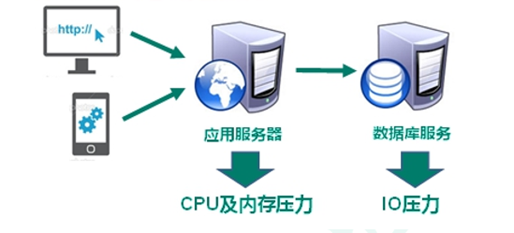
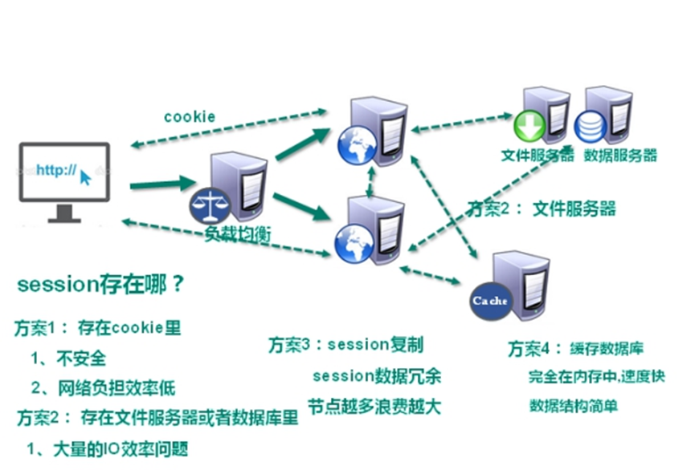
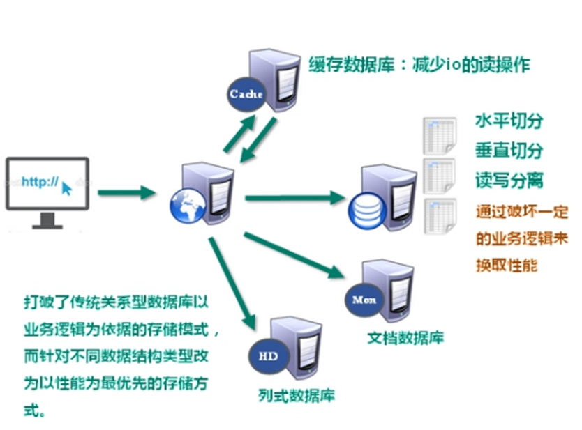
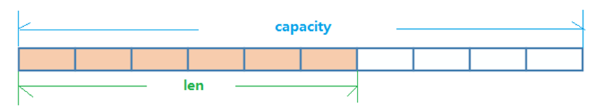

# NoSQL数据库简介

## 技术发展

### 技术分类

1. 解决功能性的问题：Java、Jsp、RDBMS、Tomcat、HTML、Linux、JDBC、SVN
2. 解决扩展性的问题：Struts、Spring、SpringMVC、Hibernate、Mybatis
3. 解决性能的问题：NoSQL、Java线程、Hadoop、Nginx、MQ、ElasticSearch

#### Web1.0时代

数据量访问有限，是单体应用

#### Web2.0时代

数据量大幅增加，CPU及内存压力增加。



#### CPU及内存的压力



#### 解决IO压力



## NoSQL数据库

### NoSQL数据库概述

NoSQL(NoSQL = **Not Only SQL** )，意即“不仅仅是SQL”，泛指**非关系型的数据库**。 

NoSQL不依赖业务逻辑方式存储，而以简单的key-value模式存储。因此大大的增加了数据库的扩展能力。

- 不遵循SQL标准。
- 不支持ACID（支持事务）。
- 远超于SQL的性能。

### NoSQL适用场景

- 对数据高并发的读写
- 海量数据的读写
- 对数据高可扩展性的

### NoSQL不适用场景

- 需要事务支持
- 基于sql的结构化查询存储，处理复杂的关系,需要即席查询。
- （用不着sql的和用了sql也不行的情况，请考虑用NoSql）

### 常见的NoSQL数据库

#### Memcache


- 很早出现的NoSql数据库
- 数据都在内存中，一般不持久化
- 支持简单的key-value模式，支持类型单一
- 一般是作为缓存数据库辅助持久化的数据库

#### Redis


- 几乎覆盖了Memcached的绝大部分功能
- 数据都在内存中，**支持持久化**，主要用作备份恢复
- 除了支持简单的key-value模式，还支持多种数据结构的存储，比如 list、set、hash、zset等。
- 一般是作为缓存数据库辅助持久化的数据库

#### MongoDB


- 高性能、开源、模式自由(schema free)的**文档型数据库**
- 数据都在内存中， 如果内存不足，把不常用的数据保存到硬盘
- 虽然是key-value模式，但是对value（尤其是**json**）提供了丰富的查询功能
- 支持二进制数据及大型对象
- 可以根据数据的特点**替代RDBMS** ，成为独立的数据库。或者配合RDBMS，存储特定的数据。

## 行式存储数据库（大数据时代）

### 行式数据库

### 列式数据库

# Redis概述安装（未完成）

## 安装版本

从[官网](http://redis.cn/)下载Redis。其版本为6.2.1 for Linux（redis-6.2.1.tar.gz），不用考虑在windows环境下对Redis的支持

## 安装步骤

### 准备工作

下载安装最新版的gcc编译器，安装C语言的编译环境

```bash
yum install centos-release-scl scl-utils-build

yum install -y devtoolset-8-toolchain

scl enable devtoolset-8 bash
```

测试gcc版本：

```
gcc --version
```

### 安装

1. 下载redis-6.2.1.tar.gz放/opt目录
2. 解压命令：tar -zxvf redis-6.2.1.tar.gz
3. 解压完成后进入目录：cd redis-6.2.1
4. 在redis-6.2.1目录下再次执行make命令（只是编译好）
5. 如果没有准备好C语言编译环境，make 会报错—Jemalloc/jemalloc.h：没有那个文件
6. 解决方案：运行make distclean
7. 在redis-6.2.1目录下再次执行make命令（只是编译好）
8. 跳过make test 继续执行: make install

# 常用五大数据类型

## Redis键(key)

`keys *`查看当前库所有key  (匹配：keys *1)

`exists key`判断某个key是否存在

`type key`查看你的key是什么类型

`del key`删除指定的key数据

`unlink key`根据value选择非阻塞删除。仅将keys从keyspace元数据中删除，真正的删除会在后续异步操作。

`expire key 10`10秒钟：为给定的key设置过期时间

`ttl key`查看还有多少秒过期，-1表示永不过期，-2表示已过期

`select n`命令切换数据库，n为库的名称

`dbsize`查看当前数据库的key的数量

`flushdb`清空当前库

`flushall`通杀全部库

## Redis字符串(String)

### 简介

String是Redis最基本的类型，你可以理解成与Memcached一模一样的类型，一个key对应一个value。String类型是二进制安全的。意味着Redis的string可以包含任何数据。比如jpg图片或者序列化的对象。String类型是Redis最基本的数据类型，一个Redis中字符串value最多可以是**512M**。

### 常用命令

`set <key> <value>`添加键值对

`get <key>`查询对应键值

`append <key> <value>`将给定的<value> 追加到原值的末尾

`strlen <key>`获得值的长度

`setnx <key> <value>`只有在 key 不存在时  设置 key 的值

`incr <key>`将 key 中储存的数字值增1，只能对数字值操作，如果为空，新增值为1。

`decr <key>`将 key 中储存的数字值减1，只能对数字值操作，如果为空，新增值为-1。

`incrby / decrby <key> <步长>`将 key 中储存的数字值增减。自定义步长。

`mset <key1> <value1> <key2> <value2> .....` 同时设置一个或多个 key-value对 

`mget <key1> <key2> <key3> .....`同时获取一个或多个 value 

`msetnx <key1> <value1> <key2> <value2> .....` 同时设置一个或多个 key-value 对，当且仅当所有给定 key 都不存在。

`getrange <key> <起始位置> <结束位置>`获得值的范围，类似java中的substring，**前包，后包**

`setrange <key> <起始位置> <value>`用 \<value> 覆写\<key>所储存的字符串值，从\<起始位置>开始(**索引从0开始**)。

`setex <key> <过期时间> <value>`设置键值的同时，设置过期时间，单位**秒**。

`getset <key> <value>`以新换旧，设置了新值同时获得旧值。

### 数据结构

String的数据结构为简单动态字符串(Simple Dynamic String，缩写SDS)。是可以修改的字符串，内部结构实现上类似于Java的ArrayList，采用预分配冗余空间的方式来减少内存的频繁分配。



如图中所示，内部为当前字符串实际分配的空间capacity一般要高于实际字符串长度len。当字符串长度小于1M时，扩容都是加倍现有的空间，如果超过1M，扩容时一次只会多扩1M的空间。需要注意的是字符串最大长度为**512M**。

## Redis列表(List)

# Redis配置文件介绍

# Redis的发布和订阅

# Redis新数据类型

# Redis_Jedis_测试

# Redis_Jedis_实例

# Redis与SpringBoot整合

# Redis的事务秒杀案例

# Redis持久化值RDB

# Redis持久化之AOF

# Redis的主从复制

# Redis集群

# Redis应用问题解决

# Redis6.0新功能